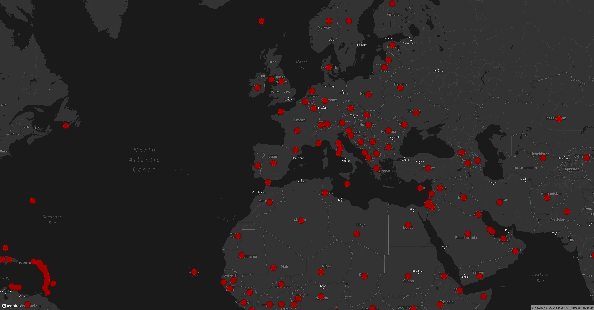

# COVID-19 Visualiser

This is a simple visualiser using `react-map-gl` and an [open dataset](https://corona.lmao.ninja/v2/countries).

This shows the daily totals of cases per country.

*Demo:* https://cranky-franklin-bf220d.netlify.app/

## To-Do

- Add further data such as US county breakdowns and add that to the heatmap.

- Add information on hover over the heatmap to show interesting data.

## Screenshot

